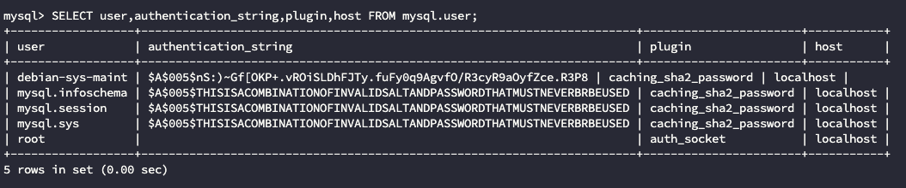

新安装的最新版本MySQL，可以在服务器终端登录root账户，但是外部始终登录不上，报连接拒绝错误
```
mysqli::real_connect(): (hy000/1698): access denied for user 'root'@'localhost'
```
<!-- more -->
这时突然想到我一直用的初始密码，可能是root账户用的`auth_socket`认证，于是终端登录进去一看，果然是这样(事实上root都还没设置密码)

  

知道原因就很简单了，直接修改root的密码和认证插件

```
ALTER USER 'root'@'localhost' IDENTIFIED WITH caching_sha2_password BY 'xxxxxx';
```

`caching_sha2_password`和`sha256_password`都是使用SHA-256哈希认证，只是前者会使用缓存来获取更好的性能
